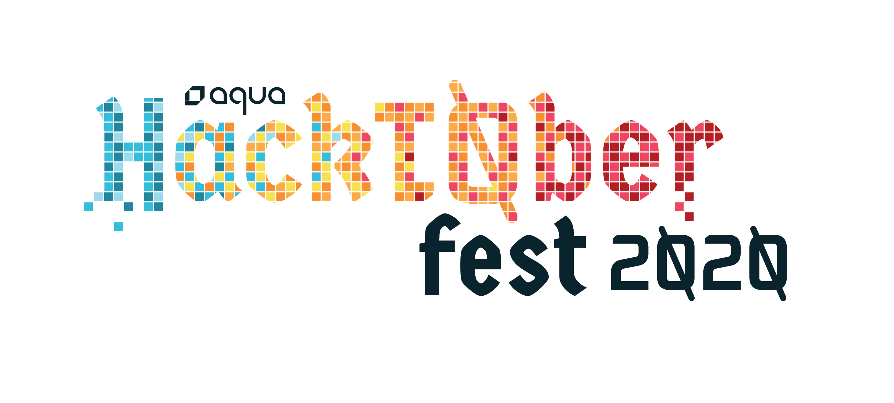

At Aqua, we believe open source is an essential part of our success and growth, and that by building our open source community we help improve security across the cloud native ecosystem.

## What is Hacktoberfest?
For some people October is a month of beer, and for others (like us) it’s hacking time! Hacktoberfest, named after the famous [German festival Oktoberfest](https://en.wikipedia.org/wiki/Oktoberfest), is a wonderful initiative that invites developers from around the world to participate and contribute to Open Source.  

Many projects and companies participate in Hacktoberfest by encouraging contributions in different ways, like rewarding you with prizes! Take a look at the [Hacktoberfest campaign](https://hacktoberfest.digitalocean.com/) where you can learn more about Hacktoberfest and the participating projects and companies, and apply for more rewards.

## What is Aqua Security doing for Hacktoberfest?
All year long, everyone is welcome to join our communities and contribute to our projects, but for contributions made during October 2020, we will reward you with prizes according to the following criteria:

Criteria | Prize
--- | ---
1 contribution | Aqua open source sticker pack or [face mask](mask.jpg) (your choice)
3 contributions | Aqua open source sticker pack or [face mask](mask.jpg) (your choice)   + [Aqua Hacktoberfest t-shirt](shirt.jpg)

In addition, we will send the recent [Kubernetes Security book](https://www.oreilly.com/library/view/kubernetes-security/9781492039075/) signed by [Liz Rice](https://www.lizrice.com/) to the 3 contributors who, in out judgement, made the best and most useful contributions.

Read on for more details on what counts as a contribution, and how we're tracking eligible contributions.

## How can I help?
We are looking for meaningful contributions to our open source projects. For example: Adding new features, fixing bugs, improving documentation, integrating with other software, even creating content in other places that educates about our projects can count.

Please focus your attention on the following projects:
1. [kube-bench](https://github.com/aquasecurity/kube-bench)
2. [Trivy](https://github.com/aquasecurity/Trivy)
    - [fanal](https://github.com/aquasecurity/fanal)
    - [trivy-db](https://github.com/aquasecurity/trivy-db)
3. [Tracee](https://github.com/aquasecurity/tracee)
4. [Starboard](https://github.com/aquasecurity/Starboard)
5. [kube-hunter](https://github.com/aquasecurity/kube-hunter)

### External contributions
You can contribute to our projects in many ways besides changes to the code. This year, we're recognizing two types of External Contributions:

**Out of repo**: Some contributions are about integrating our tools with other tools. These integrations might not belong in the main repository of the project  - sometimes it makes more sense to create your own repository for these integration projects. For example: integrating Trivy with a CI system, or integrating the Starboard report with some dashboard tool.

**Non-code**: Sometimes Open Source contributions are not about code at all. For example, you could make a video explaining one of our tools, or write an article about how you used it, which creates value and helps the ecosystem just as much as writing code. The content you create can be any of the following categories:
1. Introduction - present the project for newcomers.
2. Review - tell people what you think about the project and why you like it.
3. Tutorial - technically explain how to complete a certain task.
4. Case study - present how you (or the company you work for) have used this tool, or are planning to use it.

To get these external contributions recognized for our Hacktoberfest swag prizes, you'll need to create an Issue and then a Pull Request here in this Hacktoberfest repo - read on for more details. 

## Contribution workflow

1. Only contributions related to the participating projects listed above will be considered.
2. Eligible contributions **must start with a Github Issue describing the work item**.
    1. For any contribution, first look for an existing Issue. If it doesn't already exist, open a new Issue in the project's repo. 
    2. For external contributions, please create an issue in this repository ([Hacktoberfest](https://github.com/aquasecurity/Hacktoberfest)) describing what you're planning to do. 
3. Create a Pull Request with your contribution.
    1. Read the contributions guidelines for the relevant project.
    2. Link to the relevant Issue in the PR description.
    3. External contributions: please create the PR to the [contrib-integrations.md](contrib-integrations.md) document adding your work.
    4. Non-code contributions: please create the PR to the [contrib-content.md](contrib-content.md) document adding your work.
4. A maintainer will label eligible PRs with the `#hacktoberfest-approved` label. 
    1. PRs that don't correspond to an existing Issue are not eligible. 
    2. PRs that don't relate to the participating projects are unlikely to be approved, but please feel free to raise ideas here in the [Discussions](https://github.com/aquasecurity/Hacktoberfest/discussions) tab. 
    2. PRs that add meaningful improvements to docs are great! But swag-hunters please note: PRs that make only superficial changes will not be eligible. For example: simply adding or removing punctuation is not eligible, but adding a missing heading into a table of contents or fixing a broken link is eligible. In all cases, there needs to be a corresponding issue for your PR. 
5. Claim your prize by filling out [this form](https://forms.office.com/Pages/ResponsePage.aspx?id=80wDvGtWykGfJF3ElHSwXoMzxQ44cLZDuLrHx6o4yX1UNklOSjVNOVFCSUtMVkVKR1VEU1haQVpUOS4u).

## I have questions
If you want to discuss a particular contribution, it's best to discuss in context at the  related Github Issue or PR.  
For anything else regarding our Hacktoberfest campaign, you can engage in conversation with us using the [Discussions](https://github.com/aquasecurity/Hacktoberfest/discussions) tab in this repository. 

## Good luck and happy Hacktoberfest!

